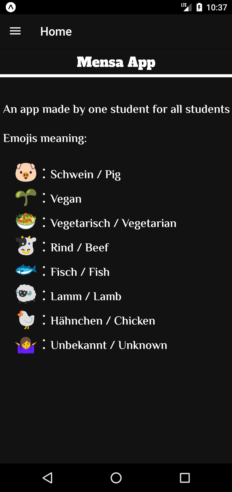
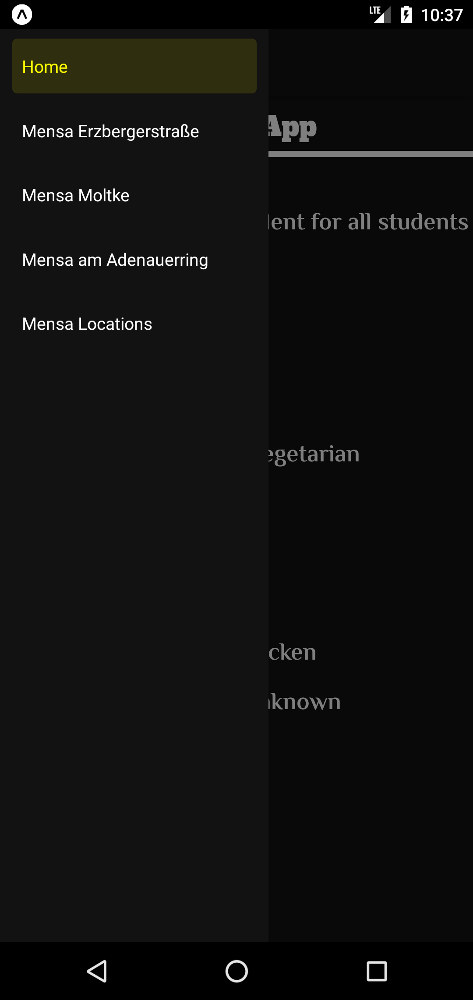
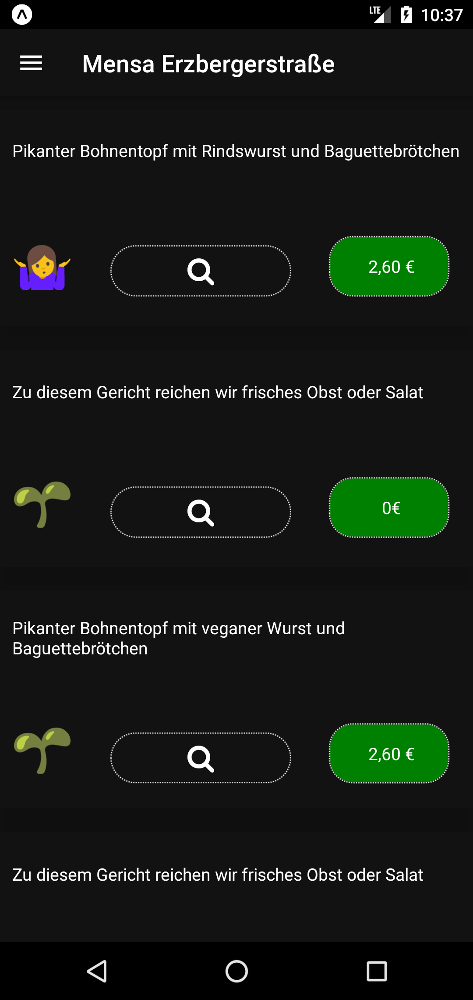
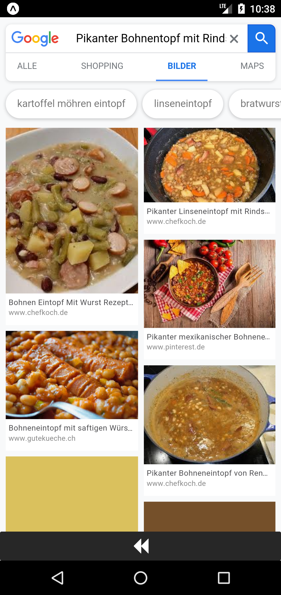
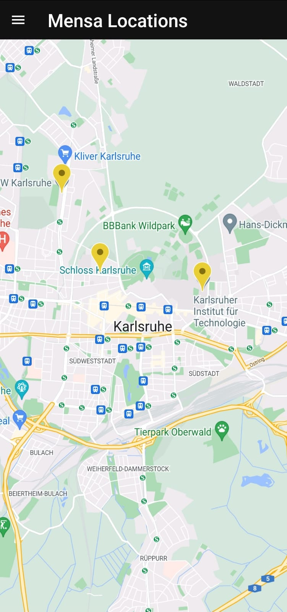
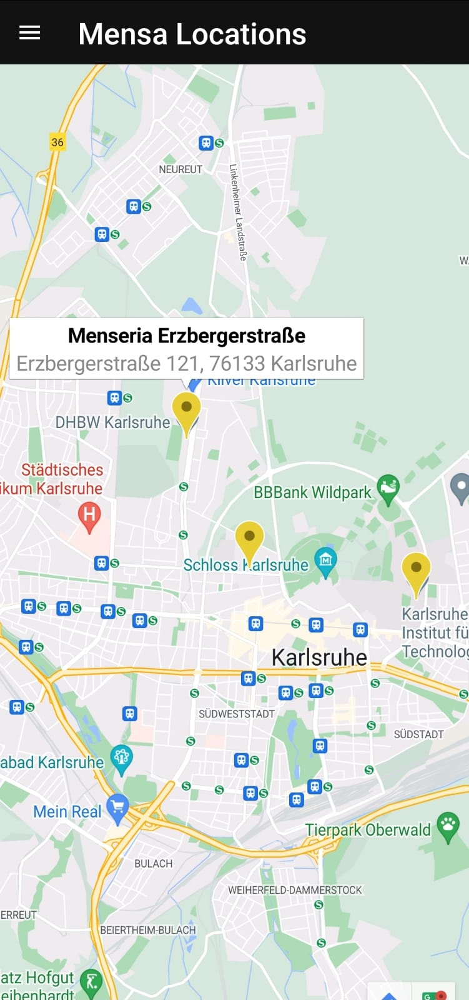

# Mensa App

### The Mensa app uses web scraping technology to get all the necessary information from the Mensa websites.

### Information like:

      food names
      descriptions
      Prices

### If you don't know where the Mensa is, you can check the Mensa Locations page.

## The App

### Home screen

### App Navigation

###  Let check the Mensa Erzbergerstraße

###  🤷‍♂️ Emoji! I do not know what this food is, so I will click on the search button 

### wait ! ;)

### To go back, I need to click on the back button

### Mensa locations

### But where is the Mensa Erzbergerstraße? To answer this question,you need to click on the map marker 🤖

Happy Hack :)

